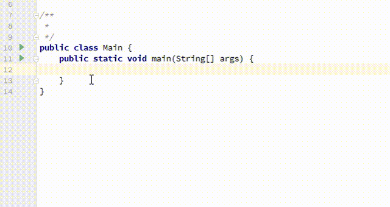
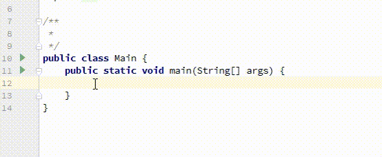

# IDE icons for experimental and beta Java annotations
[](https://opensource.org/licenses/Apache-2.0)

This is an IntelliJ/Android Studio IDE plugin to detect the code with 
**@Experimental** and **@Beta** annotations and show a custom icon on the gutter
when you use it.



Note that the method `switchMapSingle()` is annotated with the `io.reactivex.annotations.Experimental`
annotation. Another example of function annotated with a custom `Beta` annotation:



## Why would I want to use this plugin?
We are developers, and we write hundreds of lines of code and use tons 
of libraries each day. How many of these libraries contain beta and 
experimental classes and functions?. Which is the answer?. 
Well, you've probably never thought of that, but I can tell you that there are **many!**

You don't trust me? Take a look to [RxJava](https://github.com/ReactiveX/RxJava) (I :cupid: RxJava). 
You are probably using **beta** and **experimental** functions/classes in your
production code and you don't know it! 

With this plugin you know when you are using a beta or experimental piece of 
code

## Install the plugin
There are two methods to install this plugin. The first, clone this repo and build the plugin 
jar to install it manually into the IDE. The second method, the recommended, search
into the Jetbrains plugin manager this plugin `Icons for Java annotations` and install it
> Note that at this moment the plugin is pending JetBrains approval. If you want to
test it you need to install it manually!

### Manual installation
First clone this repo:
```sh
git clone https://github.com/fooock/detect-experimental-and-beta-code.git
cd detect-experimental-and-beta-code
```
Build the plugin using gradle
```sh
./gradlew build
```
The compiled plugin is in the `build/libs` directory. Now open your IDE and go to `Settings -> Plugins -> Install plugin from disk...`
and select the plugin. **Restart** your IDE.

Do you have any question? [Ask here](https://github.com/fooock/detect-experimental-and-beta-code/issues)

## How it works?
The operation of this plugin is very simple, it reads the code of the file that is currently
open and if it finds an annotation that is called `Experimental` or `Beta` it paints an icon
in the IDE gutter. That's all!

Is important to note that the annotation package name is ignored. Using this behavior allows us to
always display the icons, regardless of the library that is being used to annotate our code. Do you 
have any question? [Ask here](https://github.com/fooock/detect-experimental-and-beta-code/issues)

## Icons
The icons used by this plugin are from the github markdown emoji markup. I 
found in [this repo](https://gist.github.com/rxaviers/7360908) a complete list.
For the detected `@Experimental` annotations the :boom: icon is used, and for
the `@Beta` annotation the :fire: icon is used.

## Credits
To create the gifs for this readme I used the online service from [cloudconvert](https://cloudconvert.com/webm-to-gif).
For the video record I use the [Icecream apps screen recorder](https://icecreamapps.com/Screen-Recorder/) application.
Thanks!

## License
```
Copyright 2017 newhouse (nhitbh at gmail dot com)

Licensed under the Apache License, Version 2.0 (the "License");
you may not use this file except in compliance with the License.
You may obtain a copy of the License at

    http://www.apache.org/licenses/LICENSE-2.0

Unless required by applicable law or agreed to in writing, software
distributed under the License is distributed on an "AS IS" BASIS,
WITHOUT WARRANTIES OR CONDITIONS OF ANY KIND, either express or implied.
See the License for the specific language governing permissions and
limitations under the License.
```